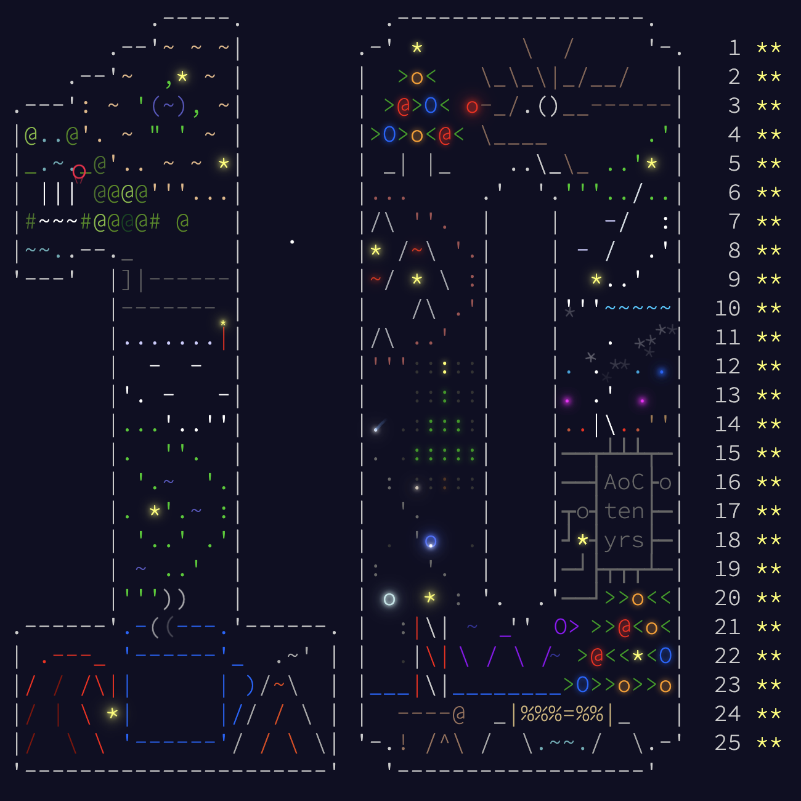

# Advent of Code 2024 in Rust

This repository contains my solutions for the Advent of Code 2024 in Rust. 

Each day of AoC is organized into its own folder with the input and the solution file. 

Each solution file has a `run_a` and `run_b` function, for each part of the problem.

Note: To run these solutions, you'll need an `input.txt` in each given day folder (they are ignored due to Advent of Code guidelines)

## Solutions

[Day 1](./src/day_1/day_1.rs)

[Day 2](./src/day_2/day_2.rs)

[Day 3](./src/day_3/day_3.rs)

[Day 4](./src/day_4/day_4.rs)

[Day 5](./src/day_5/day_5.rs)

[Day 6](./src/day_6/day_6.rs)

[Day 7](./src/day_7/day_7.rs)

[Day 8](./src/day_8/day_8.rs)

[Day 9](./src/day_9/day_9.rs)

[Day 10](./src/day_10/day_10.rs)

[Day 11](./src/day_11/day_11.rs)

[Day 12](./src/day_12/day_12.rs)

[Day 13](./src/day_13/day_13.rs)

[Day 14](./src/day_14/day_14.rs)

[Day 15](./src/day_15/day_15.rs)

[Day 16](./src/day_16/day_16.rs)

[Day 17](./src/day_17/day_17.rs)

[Day 18](./src/day_18/day_18.rs)

[Day 19](./src/day_19/day_19.rs)

[Day 20](./src/day_20/day_20.rs)

[Day 21](./src/day_21/day_21.rs)

[Day 22](./src/day_22/day_22.rs)

[Day 23](./src/day_23/day_23.rs)

[Day 24](./src/day_24/day_24.rs)

[Day 25](./src/day_25/day_25.rs)
